# CRUD Room
Aplicación para relaizar altas, bajas, modificaciones y consultas con Room.
 
En este caso, se crea una aplicación para crear un producto, modificarlo, eliminarlo y listar todos los productos que fueron creados.
 
 
Para ello se utilizó:
<ul>
  <li>MVC</li>
  <li>Room</li>
  <li>DB SQLite Browser (para la prepropagación de la base de datos con un listado de categorias</li>
 </ul>
 
# Esquema Base de datos
 
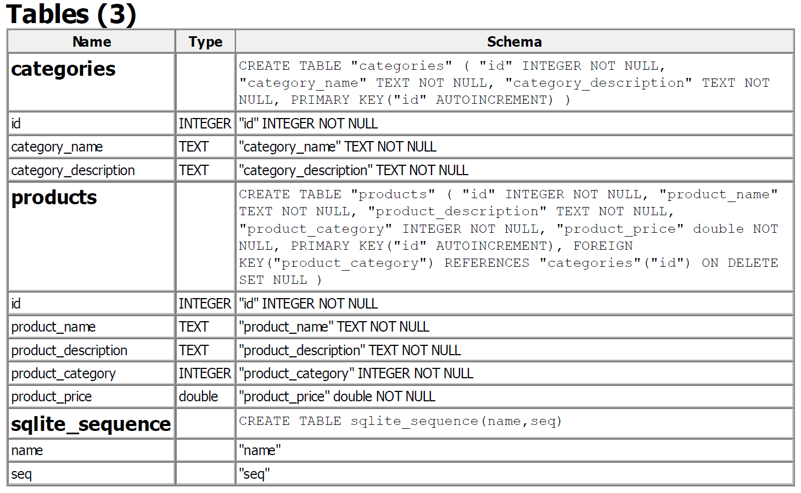
 
## Imágenes de la aplicación
 
<table>
  <tr>
    <td>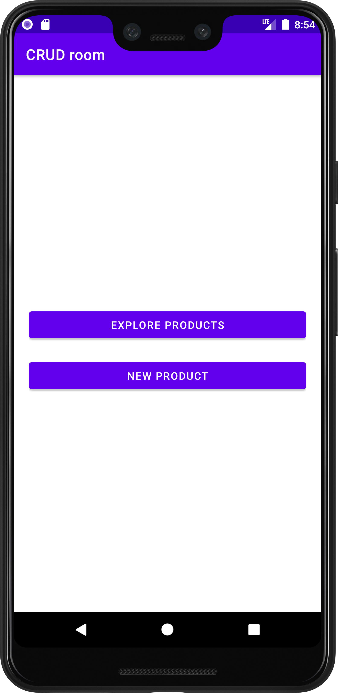</td>
    <td>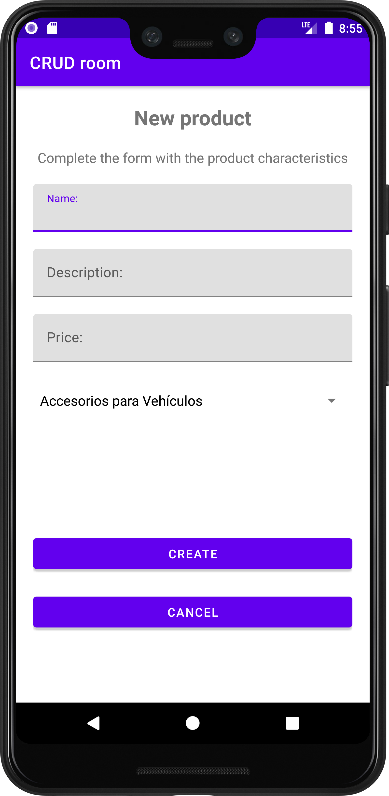</td>
    <td>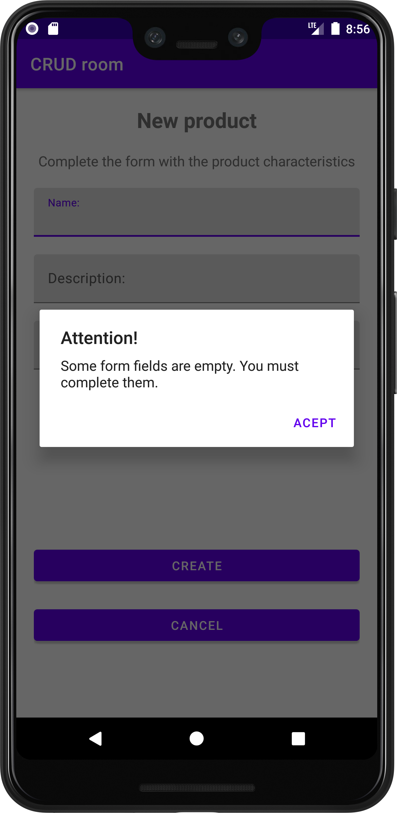</td>
    <td>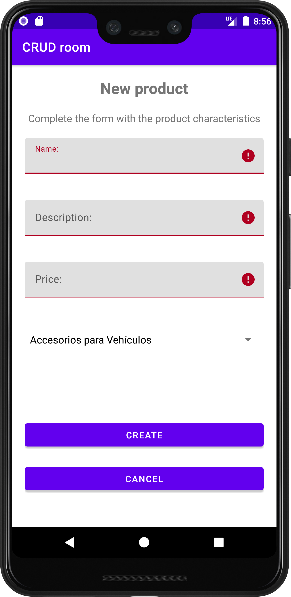</td>
    <td>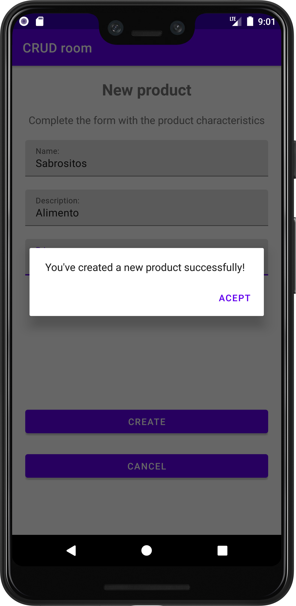</td>
  </tr>
  <tr>
    <td>Pantalla principal</td>
    <td>Agregar producto</td>
    <td>Alerta formulario incompleto</td>
    <td>Formulario incompleto</td>
    <td>Producto creado</td>
  </tr>
  <tr>
    <td>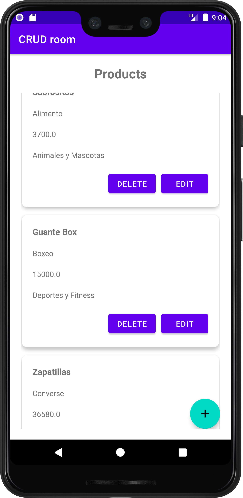</td>
    <td>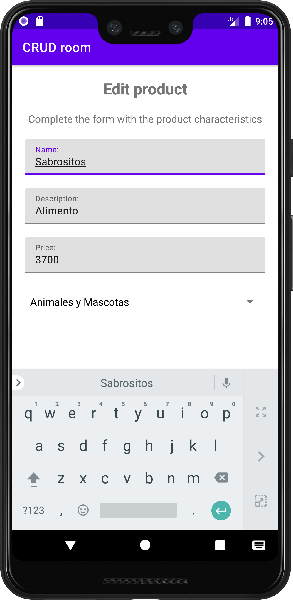</td>
    <td>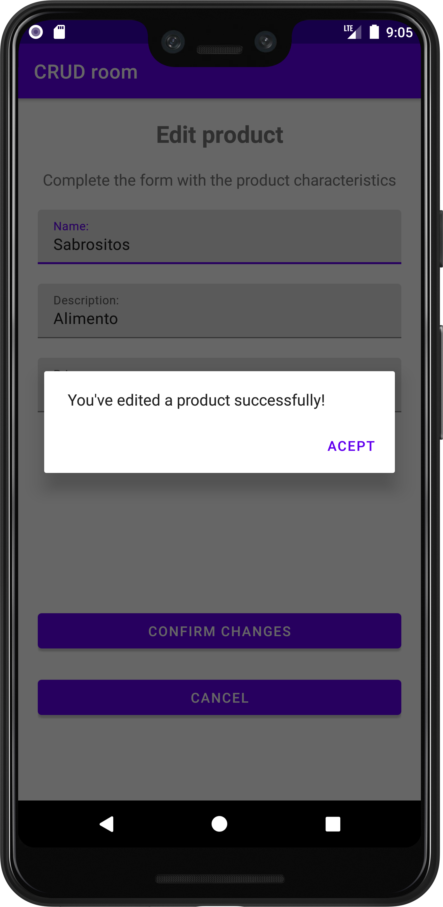</td>
    <td>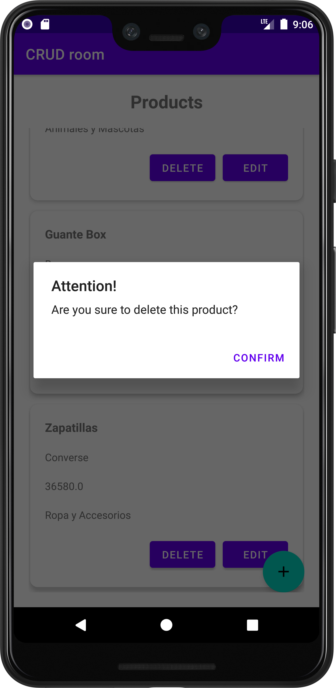</td>
    <td>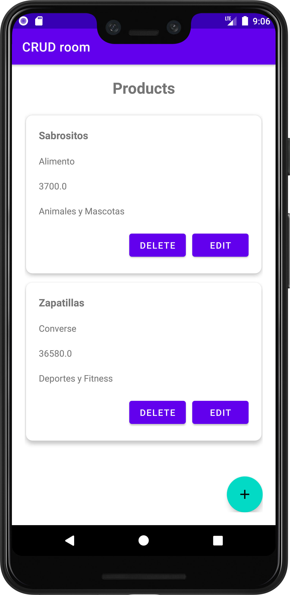</td>
  </tr>
  <tr>
    <td>Listado productos</td>
    <td>Pantalla modificar producto</td>
    <td>Mensaje producto modificado</td>
    <td>Mensaje confirmar eliminación</td>
    <td>Listado actualizado</td>
  </tr>
</table>

